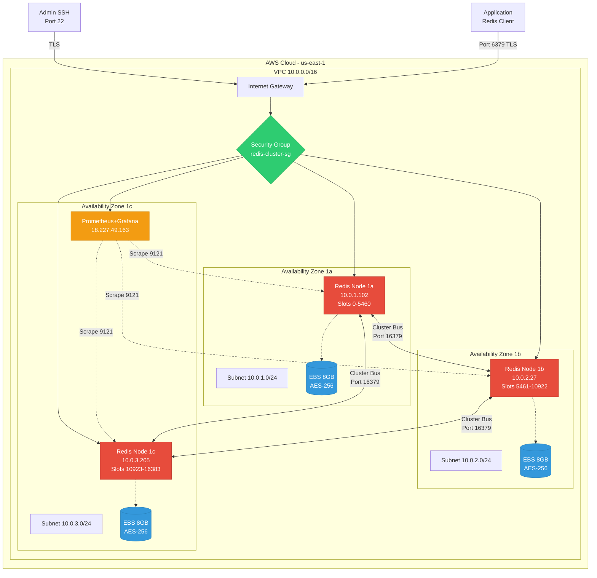
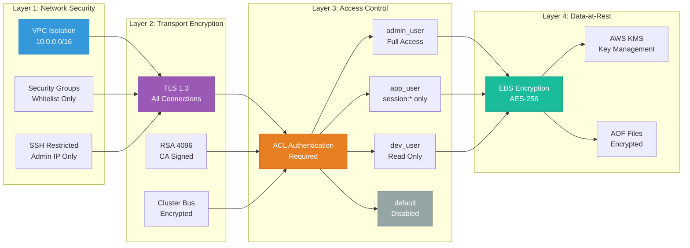
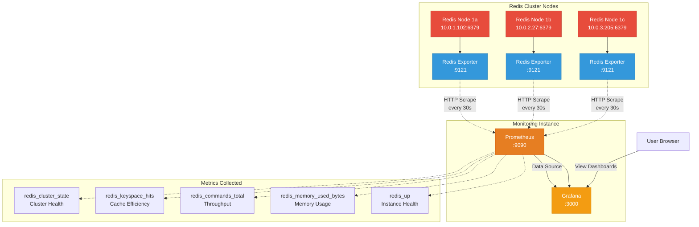
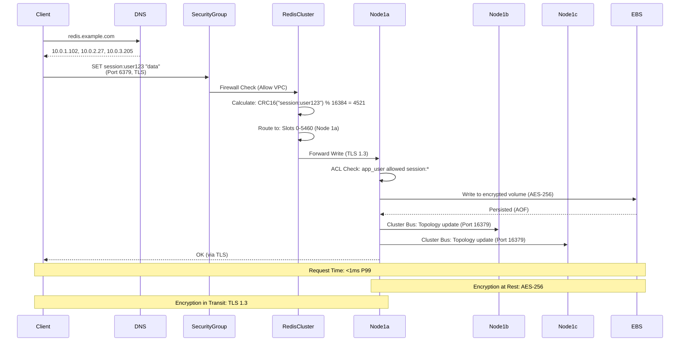
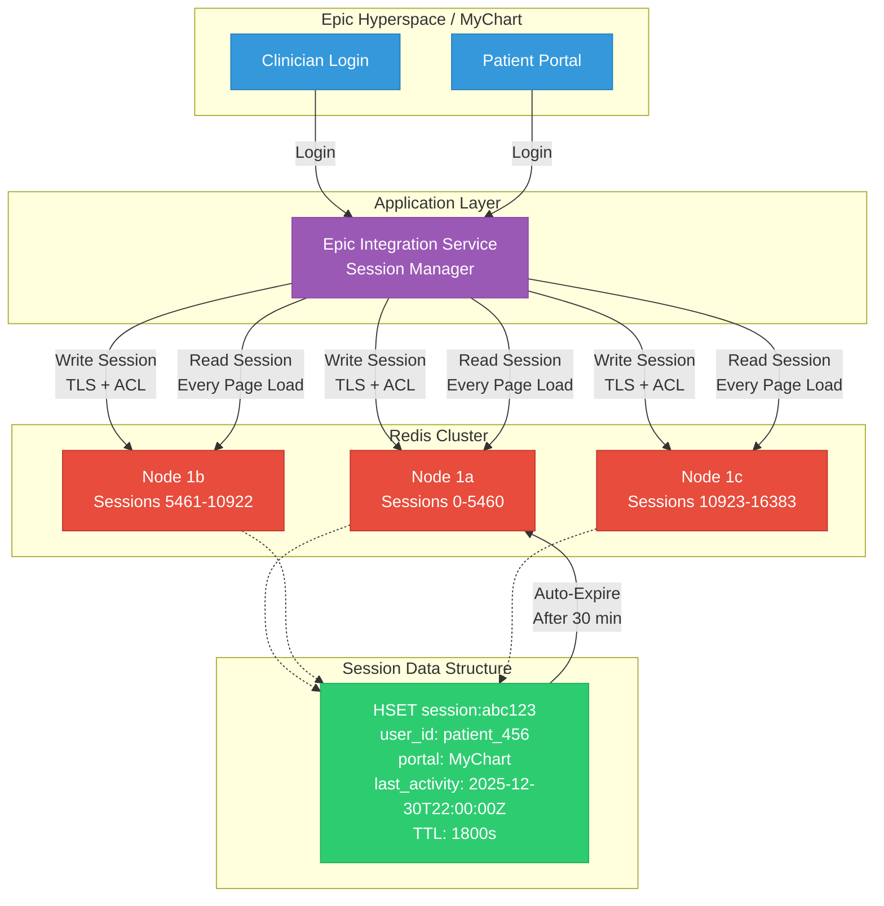

# Architecture Diagrams

Visual representations of the Epic Redis infrastructure.

---

## 1. AWS System Architecture

**Architecture Highlights:**

- **Multi-AZ Deployment:** 3 availability zones for fault tolerance
- **Cluster Mode:** 16,384 hash slots distributed across 3 masters
- **Encrypted Storage:** AES-256 EBS volumes for data-at-rest protection
- **Monitoring:** Dedicated Prometheus/Grafana instance for observability

---

## 2. Security Layers (Defense-in-Depth)

**HIPAA Compliance:**

- ✅ Encryption in Transit (TLS 1.3)
- ✅ Encryption at Rest (AES-256)
- ✅ Access Controls (Role-based ACLs)
- ✅ Network Isolation (VPC + Security Groups)

---

## 3. Monitoring Stack Architecture

**Monitoring Capabilities:**

- **Real-time Metrics:** 30-second scrape interval
- **Grafana Dashboards:** Pre-built Redis dashboard (ID: 11835)
- **Alert-Ready:** Prometheus rules for critical thresholds
- **Production-Grade:** Enterprise observability stack

---

## 4. Data Flow & Request Routing

**Request Flow Details:**

1. **Client Discovery:** DNS/cluster-aware client knows all node IPs
2. **Slot Calculation:** `CRC16(key) % 16384` determines routing
3. **TLS Encryption:** All client-server communication encrypted
4. **ACL Verification:** User permissions checked on target node
5. **Persistence:** Write to encrypted EBS volume (AOF)
6. **Cluster Sync:** Topology changes propagated via cluster bus

---

## 5. Epic EHR Integration Pattern

**Epic Use Case Benefits:**

- **Performance:** Sub-1ms session lookup vs 50-100ms database
- **Compliance:** Automatic 30-minute session expiration (HIPAA)
- **Scalability:** Handles 10,000+ concurrent clinician sessions
- **High Availability:** Multi-AZ deployment ensures 24/7 uptime

---

## Diagram Usage

These diagrams are created using Mermaid and render automatically on GitHub. They can also be:

- **Exported as PNG** - For presentations or documentation
- **Embedded in Slides** - Copy diagram code into Mermaid Live Editor
- **Updated Easily** - Text-based diagrams are version controlled

**Editing:** Modify the diagram code directly in this markdown file. GitHub will automatically render the updated diagrams.

**Tools:**

- [Mermaid Live Editor](https://mermaid.live/) - Test and export diagrams
- [GitHub Markdown](https://github.com) - Native Mermaid rendering
- VS Code: Mermaid Preview extension for local editing

---

**Last Updated:** 2025-12-30  
**Maintainer:** Infrastructure Team  
**Diagram Count:** 5 architectural views
